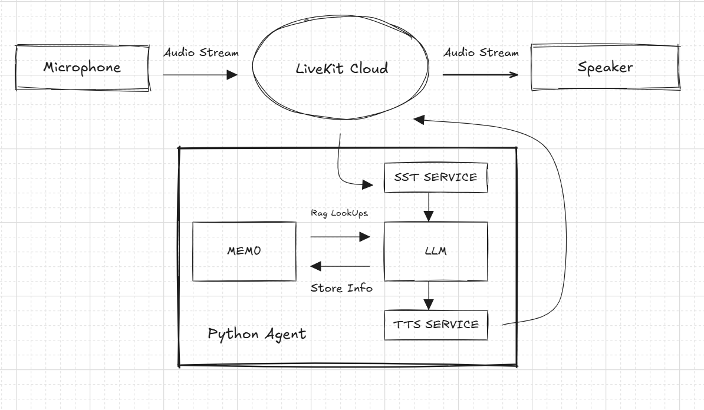

# Memory-Enabled LiveKit Agent

This project implements a voice + vision AI agent with memory, powered by LiveKit Agents
, Mem0
, and multiple AI plugins (OpenAI, Deepgram, Silero, Cartesia, etc.).

## Highlights
- **Memory-enabled**: Stores user interactions into Mem0 and retrieves them later for context.
- **Multi-modal**: Handles voice, text, and images.
- **Real-time**: Powered by LiveKit RTC streams.
- **Noise cancellation & VAD**: Uses Silero + LiveKit plugins.
- **Customizable**: Swap STT, TTS, or LLM providers as needed.
  
## Architecture



## ⚙ Requirements

- Python 3.10+
- Virtual environment (recommended)
  
## 📡 Environment Setup

Create a .env file in the project root and fill the key from .env.example in agent and web.

**🚀 Running the Agent:**

1. Start your virtual environment:
```console
  python -m venv venv
  source venv/bin/activate   # Linux / Mac
  venv\Scripts\activate      # Window
  ```
2. Run your agent:

  ```console 
    cd agent
    python mem0-agent.py download-files
    python mem0-agent.py dev

    cd ../web
    npm i && npm run dev
  ```

Or use docker for agent setup

---
